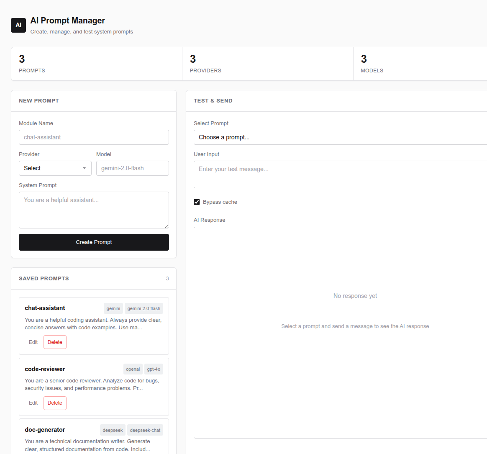
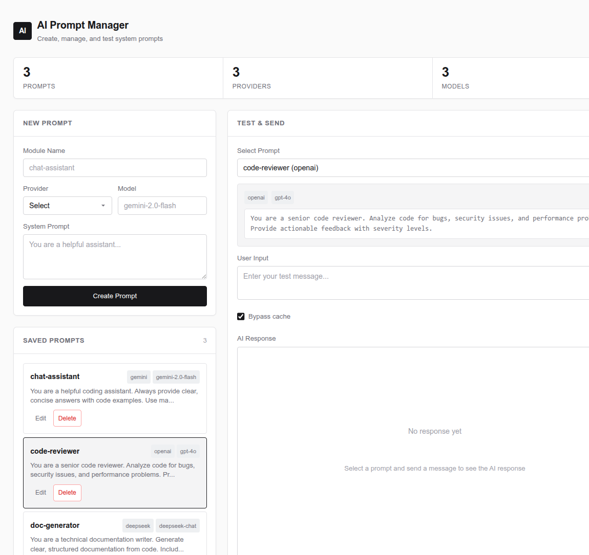
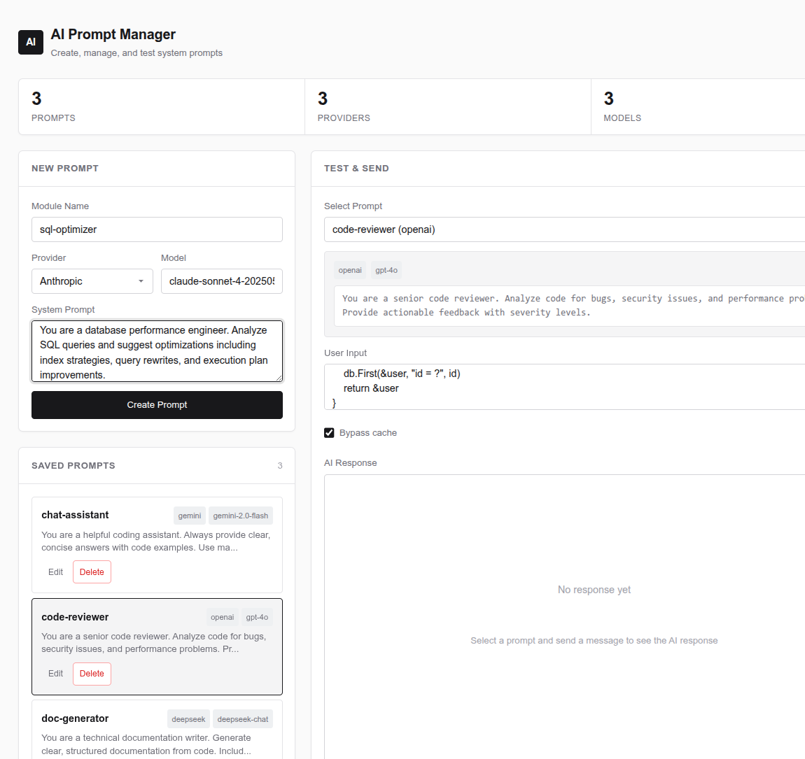
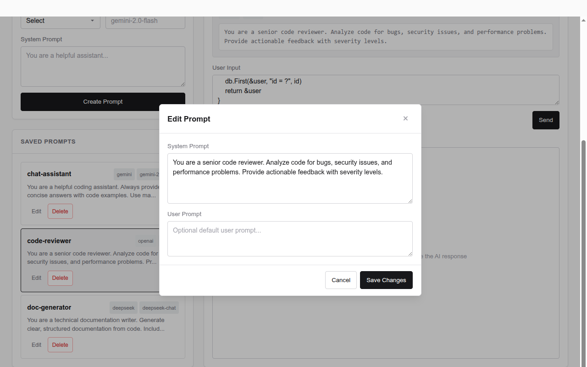
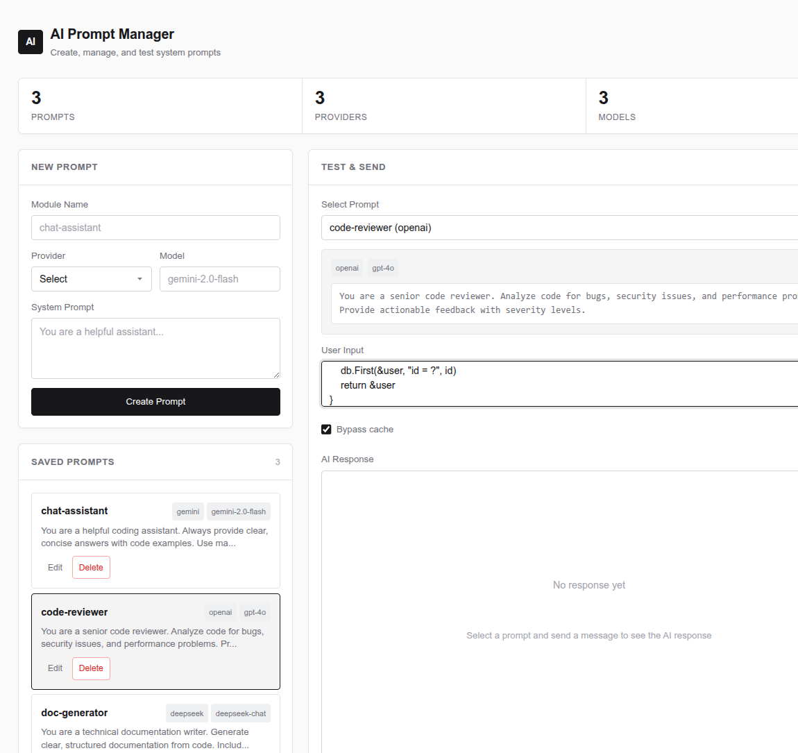
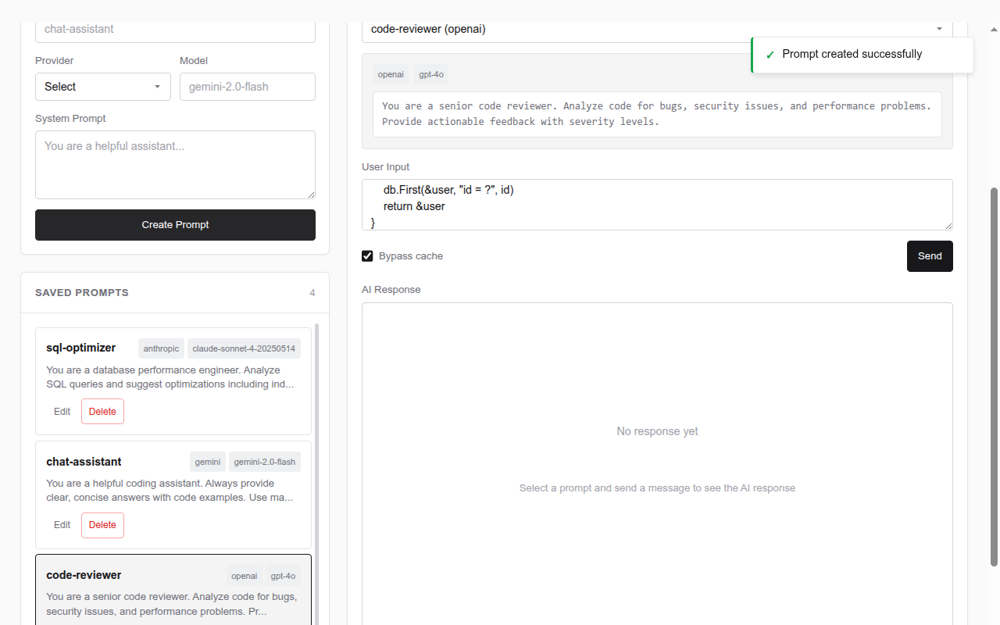

# AI Prompt Service

A production-grade Go backend for managing and dispatching AI system prompts across multiple LLM providers (Gemini, OpenAI, DeepSeek, Anthropic) — with SHA-256 response caching, Redis rate limiting, usage audit logging, and a built-in testing UI.

<p align="center">
  
</p>

---

## What This Is

Most teams using LLMs hardcode system prompts in application code. When a prompt needs tuning, it requires a code deploy. When you switch from Gemini to OpenAI, the request format changes and the integration breaks.

This service solves that. System prompts are stored as database records — editable at runtime, dispatched through a provider-agnostic engine that adapts request payloads per provider via Go text/templates. A SHA-256 hash of the prompt + module + user input enables response caching, so identical requests skip the LLM API call entirely. Redis-backed rate limiting protects against runaway costs. Every API call is logged with full request/response for audit.

## Features

| Feature | Implementation |
|---|---|
| Multi-provider dispatch | Gemini, OpenAI, DeepSeek, Anthropic via config-driven templates — no code changes to add a provider |
| Response caching | SHA-256 hash lookup against `ai_usage_logs` — skip API calls for identical prompts |
| Rate limiting | Per-IP sliding window via Redis `INCR`/`EXPIRE` with configurable thresholds and IP whitelist |
| Usage audit | Every LLM call logged with full request/response text, provider, timestamp, and hash |
| Graceful shutdown | `SIGINT`/`SIGTERM` handling with 10s drain timeout, connection pool cleanup |
| Transaction support | Context-key pattern threads GORM transactions through the repository layer |
| Config layering | YAML defaults + environment variable overrides at every level |
| Web UI | Single-file HTML/CSS/JS — prompt CRUD, live testing, cache bypass toggle |
| Health check | `/health` endpoint for container orchestration |
| Multi-stage Docker | Alpine runtime image with only binary + assets — no toolchain in production |

## Screenshots

| Dashboard | Prompt Selected |
|:---:|:---:|
|  |  |

| Create Form | Edit Modal |
|:---:|:---:|
|  |  |

| Test Panel with Input | Toast Feedback |
|:---:|:---:|
|  |  |

---

## Architecture

```
                    ┌─────────────────────────────────┐
                    │           Gin HTTP Server        │
                    │  (graceful shutdown, timeouts)   │
                    └──────────────┬──────────────────┘
                                   │
                    ┌──────────────▼──────────────────┐
                    │         Controller Layer         │
                    │  (request binding, HTTP status)  │
                    └──────────────┬──────────────────┘
                                   │
                    ┌──────────────▼──────────────────┐
                    │          Service Layer           │
                    │  caching · rate limit · dispatch │
                    └─────┬────────┬──────────┬───────┘
                          │        │          │
              ┌───────────▼──┐  ┌──▼───┐  ┌───▼──────────┐
              │  Repository  │  │ Redis │  │  LLM Provider │
              │  (GORM/PG)   │  │       │  │  (HTTP call)  │
              └──────────────┘  └───────┘  └──────────────┘
```

**Layer separation**: Controller → Service → Repository. Each layer has a single responsibility. The controller handles HTTP concerns (binding, status codes, error mapping). The service orchestrates business logic (cache lookup, rate limiting, API dispatch, usage logging). The repository handles persistence with context-aware transaction support.

**Transaction propagation**: The repository uses a context-key pattern (`contextTxKey`) to thread GORM transactions through the call chain. `WithTransaction()` injects a `*gorm.DB` tx into the context, and `getDB()` retrieves it — or falls back to the default connection. This allows any service method to participate in a transaction without changing its signature.

---

## Key Engineering Decisions

### Provider-Agnostic Request Engine

Each provider (Gemini, OpenAI, DeepSeek, Anthropic) has a different API shape — different URL patterns, auth methods, and request/response JSON structures. Rather than writing a separate client for each, the service uses **Go text/templates** to render provider-specific request bodies from a config-defined template:

```yaml
# config/config.yml
providers:
  - name: "gemini"
    base_url: "https://generativelanguage.googleapis.com/v1beta/models/"
    auth_method: "query_param"
    models:
      - name: "gemini-2.0-flash"
        config: |
          {
            "contents": [{
              "parts": [
                {"text": "{{.SystemPrompt}}"},
                {"text": "{{.UserPrompt}}"}
              ]
            }]
          }
        response_path: "candidates.0.content.parts.0.text"
```

Adding a new provider is a config change, not a code change. The `callAIAPI` method renders the template, sets the auth header or query param based on `auth_method`, and extracts the response text using a simple JSON path resolver (`response_path`).

### Prompt Hashing for Cache Hits

```go
func hashPrompt(systemPrompt, userPrompt, moduleName string) string {
    raw := systemPrompt + userPrompt + moduleName
    sum := sha256.Sum256([]byte(raw))
    return hex.EncodeToString(sum[:])
}
```

The hash is stored on both the `SystemPrompt` record and the `AIUsageLog`. On subsequent requests with the same prompt + input + module, the service checks `AIUsageLog` for a prior response before making an API call. A `bypass_cache` query param lets callers force a fresh call when they've edited the prompt.

### Redis Rate Limiting

Per-IP sliding window rate limiting using Redis `INCR` + `EXPIRE`. Configurable window size, request threshold, and IP whitelist. If Redis is unavailable, the rate limiter fails closed (returns error) rather than allowing unbounded access — a deliberate tradeoff favoring cost safety over availability.

### Graceful Shutdown

The server listens for `SIGINT`/`SIGTERM` via `signal.NotifyContext`, then:
1. Calls `server.Shutdown()` with a 10-second timeout to drain in-flight requests
2. Closes the PostgreSQL connection pool
3. Closes the Redis client
4. Logs exit

No goroutine leaks, no dropped requests.

---

## Tech Stack

| Layer | Technology |
|---|---|
| Language | Go 1.24 |
| HTTP Framework | Gin |
| ORM | GORM (PostgreSQL driver) |
| Database | PostgreSQL (SQLite for tests) |
| Cache / Rate Limit | Redis (go-redis/v8) |
| Config | Viper (YAML + env vars) |
| Logging | Zap (structured JSON) |
| Containerization | Docker (multi-stage build), Docker Compose |
| Frontend | Vanilla HTML/CSS/JS (single-file, no build step) |

---

## Database Schema

Three models, all UUID-keyed with GORM `BeforeCreate` hooks for database-agnostic ID generation:

- **`system_prompts`** — The prompt registry. Indexed on `module_name`, `provider`, `model_name`, `prompt_hash`. Soft deletes via GORM `DeletedAt`.
- **`ai_usage_logs`** — Every LLM API call. Stores the full request text, response text, provider, and prompt hash. Indexed on `module_name`, `provider`, `prompt_hash`. Used for cache lookups and audit.
- **`rate_limits`** — Per-module rate limit configuration (stored in DB, enforced via Redis).

Auto-migration runs on startup when `DB_MIGRATION_ENABLED=true`.

---

## API Endpoints

| Method | Path | Purpose |
|---|---|---|
| `GET` | `/health` | Health check |
| `GET` | `/ai/` | Web UI (prompt manager + test panel) |
| `POST` | `/ai/api/system-prompts/` | Create a system prompt |
| `GET` | `/ai/api/system-prompts/` | List all prompts |
| `PUT` | `/ai/api/system-prompts/:id` | Update prompt text + user prompt |
| `DELETE` | `/ai/api/system-prompts/:id` | Soft-delete a prompt |
| `POST` | `/ai/api/system-prompts/send` | Dispatch a prompt to the LLM (with caching + rate limiting) |

The `send` endpoint accepts `?cache=true` to use cached responses, or omits it to bypass cache and force a fresh API call.

---

## Testing

Repository-layer tests run against an in-memory SQLite database, not a real PostgreSQL instance. This keeps tests fast (<1s) and hermetic:

```bash
make test
# or
go test -v ./...
```

The test covers the full CRUD lifecycle: create → fetch by hash → update → list → delete → verify deletion.

---

## Configuration

Configuration is layered: YAML file (`config/config.yml`) provides defaults, environment variables override at every level. API keys are loaded from env vars named `{PROVIDER}_API_KEY` (e.g., `GEMINI_API_KEY`, `OPENAI_API_KEY`) — never stored in the config file.

See [`example.env`](example.env) for all available environment variables.

---

## Deployment

### Docker (multi-stage build)

The Dockerfile uses a two-stage build: `golang:1.24-alpine` for compilation, `alpine:latest` for the runtime image. The final image contains only the binary, templates, config, and CA certificates — no Go toolchain, no source code.

```bash
docker-compose up --build
```

Services:
- **ai-service** — The Go application (port 8082 → 8080)
- **ai-database** — PostgreSQL with persistent volume
- **redis** — Redis with persistent volume

### Local Development

```bash
# Start Postgres + Redis
docker run -d --name pg -e POSTGRES_USER=postgres -e POSTGRES_PASSWORD=postgres -e POSTGRES_DB=providers -p 5432:5432 postgres:latest
docker run -d --name redis -p 6379:6379 redis:alpine

# Run the app
go build -o tmp/main ./cmd && ./tmp/main
```

Or with live reload via [Air](https://github.com/air-verse/air):

```bash
go install github.com/air-verse/air@latest
air -c .air.toml
```

---

## Project Structure

```
├── cmd/main.go                    # Entry point: config, DI, graceful shutdown
├── config/config.yml              # Provider definitions, defaults
├── internal/
│   ├── config/                    # Viper-based config loading + validation
│   ├── controller/                # HTTP handlers (request binding, status mapping)
│   ├── database/                  # PostgreSQL + Redis connection setup
│   ├── model/                     # GORM models with BeforeCreate UUID hooks
│   ├── repository/                # Data access + context-aware transactions
│   ├── routes/                    # Route registration + DI wiring
│   └── service/                   # Business logic: caching, rate limiting, LLM dispatch
├── templates/index.html           # Single-file web UI (no build step)
├── Dockerfile                     # Multi-stage build
├── docker-compose.yml             # App + Postgres + Redis
└── Makefile                       # build, test, lint, fmt, docker lifecycle
```

---

## Tradeoffs

- **Template-based request rendering vs. typed client structs**: Templates are flexible and config-driven, but lose compile-time type safety. For a service that needs to support arbitrary new providers without code changes, the tradeoff is worth it.
- **Database-backed caching vs. Redis caching**: Response cache currently lives in PostgreSQL (`ai_usage_logs` table). This simplifies the architecture and makes cached responses queryable. Redis is used only for rate limiting, where its atomic `INCR`/`EXPIRE` operations are the right tool.
- **Soft deletes vs. hard deletes**: Prompts are soft-deleted (GORM `DeletedAt`). This preserves referential integrity with historical `ai_usage_logs` that reference deleted prompts.
- **Fail-closed rate limiting**: If Redis is down, the rate limiter returns an error instead of allowing the request through. This protects against unbounded API costs at the cost of availability.

---

## Security Considerations

- **API keys never touch the config file.** Each provider's key is loaded from an environment variable (`{PROVIDER}_API_KEY`) at startup, not stored in `config.yml` or committed to the repo.
- **Encryption key support.** The config struct includes `encryption_key` and `encryption_key_version` fields for future prompt-level encryption at rest.
- **Fail-closed rate limiting.** If Redis is unavailable, the service rejects requests rather than allowing unbounded LLM API calls — preventing cost explosions during infrastructure incidents.
- **Soft deletes preserve audit trail.** Deleted prompts remain in the database with `DeletedAt` set, maintaining referential integrity with historical usage logs.
- **Structured logging via Zap.** Production logs are JSON-formatted with caller info — no `fmt.Println` in the codebase, no sensitive data logged.
- **`.env` in `.gitignore`.** Environment files are never committed. `example.env` provides the template with placeholder values.

---

## License

MIT
